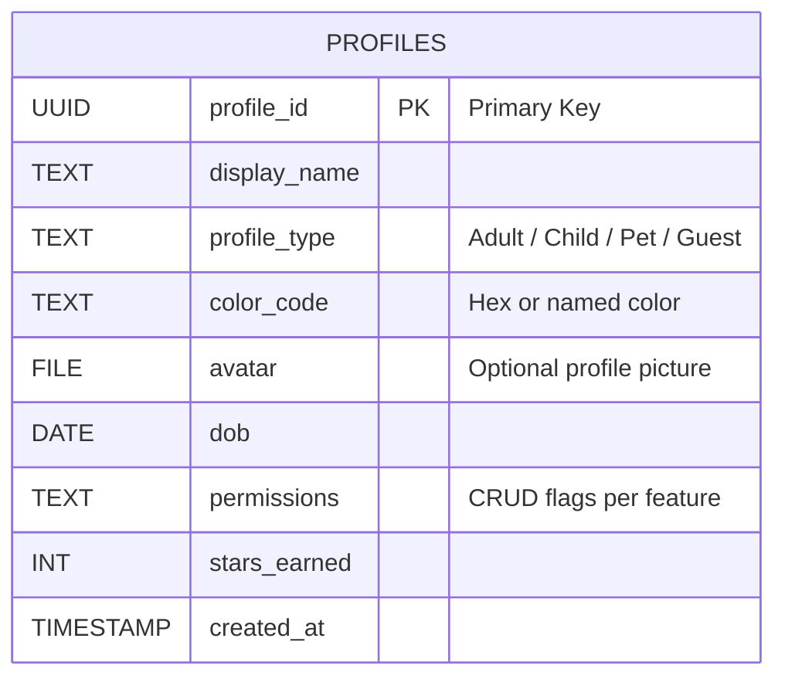

# Profiles

> \[!ADMONITION|note]
> The Profiles entity is central to all other features and includes permissions and gamification attributes.

Properties & Descriptions

| Property           | Type         | Required | Notes                          |
| ------------------ | ------------ | -------- | ------------------------------ |
| **Profile ID**     | UUID         | ✅        | Primary Key                    |
| **Display Name**   | Text         | ✅        | “Mum”, “Mia”, “Zeus (the dog)” |
| **Profile Type**   | Select       | ✅        | Adult / Child / Pet / Guest    |
| **Color Code**     | Color        | ✅        | Used in calendars & lists      |
| **Avatar / Photo** | File         |          | Optional profile picture       |
| **DOB / Age**      | Date         |          | Enables age-based restrictions |
| **Permissions**    | Multi-select |          | CRUD flags per feature         |
| **Stars Earned**   | Number       |          | Gamification tally             |
| **Created At**     | Created time | ✅        | Timestamp of creation          |

*Last updated: 24 June 2025*
